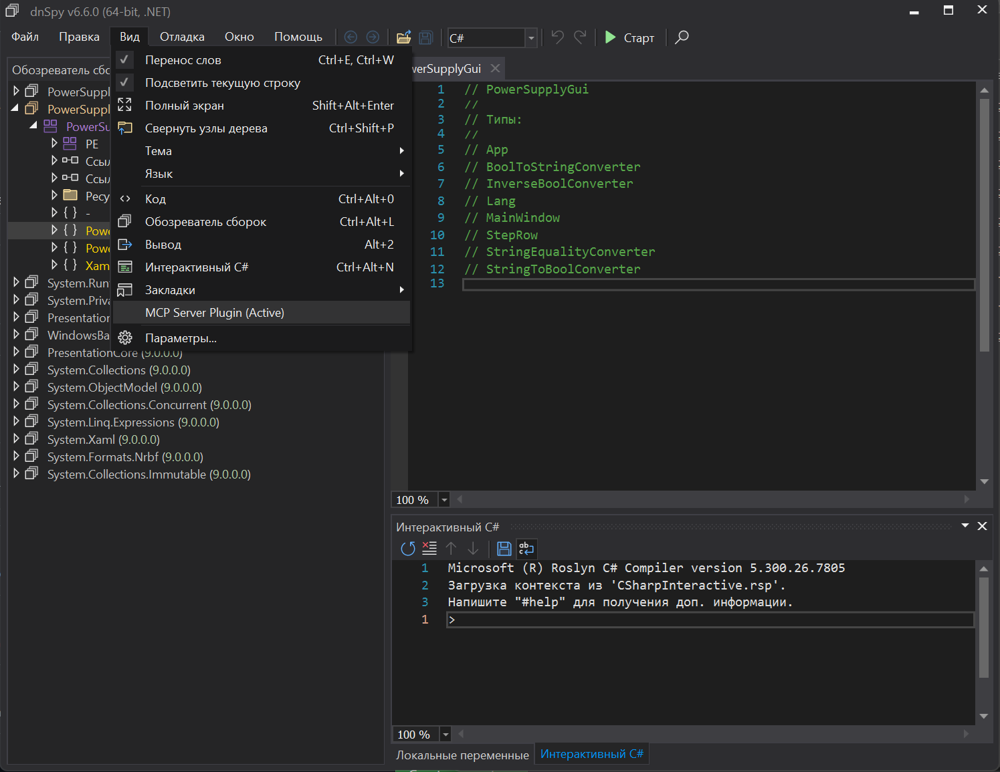

# 🚀 dnSpy MCP Plugin (Model Context Protocol)



<!-- markdownlint-disable MD024 -->

## Deutsch

Schöpfen Sie das volle Potenzial von dnSpy aus! Dieses Plugin und der MCP-Server (Model Context Protocol) verwandeln Ihre Lieblings-KI (Claude, Antigravity, ZED, Cursor) in einen Experten für Reverse Engineering. Vergessen Sie das mühsame manuelle Durchsuchen von Assemblies – bitten Sie die KI einfach, Klassen zu finden, Methoden zu dekompilieren oder direkt im laufenden Debugger nach Zeichenfolgen zu suchen.

Das Plugin macht die interne API von dnSpy zugänglich, sodass die KI den Code-Analyseprozess autonom steuern kann.

### ✨ Magische Funktionen

Das Plugin gewährt der KI vollen Zugriff auf die in dnSpy geladenen Assemblies:

- **Assembly-Analyse:** Abrufen einer Liste aller geladenen Module, Klassen, Strukturen und Schnittstellen.
- **Introspektion:** Abrufen von Listen von Methoden, Feldern und Eigenschaften für jeden beliebigen Typ.
- **Dekompilierung:** Sofortige Dekompilierung jeder Methode nach C# oder Abrufen des rohen IL-Codes.
- **Globale Suche:** Suche nach Zeichenfolgen in allen geladenen Assemblies.

**Kurz gesagt:** Die KI kann autonom durch den Code navigieren, notwendige Abschnitte dekompilieren und die Anwendungslogik analysieren.

### 🛠️ Installation des Plugins in dnSpy

1. Kompilieren Sie das Projekt oder laden Sie die fertige `dnSpy.Extension.MCP.x.dll` herunter.
2. Legen Sie die `.dll`-Datei in den Erweiterungsordner von dnSpy (normalerweise der `bin`-Ordner oder neben `dnSpy.exe`).
3. Starten Sie dnSpy. Der Server startet automatisch auf Port `5555`.

### 🔌 Verbindung zur KI (2 Optionen)

Wählen Sie je nach Ihrem KI-Assistenten eine der folgenden Verbindungsmethoden:

#### Option 1: Direkte HTTP-Verbindung (OFNEN MCU & benutzerdefinierte Clients)
Wenn Ihr Client direkte REST-API-Verbindungen unterstützt (wie unsere OFNEN MCU-App), fügen Sie den Server mit den folgenden Parametern hinzu:
- **Name:** `DNSPY_MCP`
- **Type:** `http`
- **Path:** `http://localhost:5555/mcp`

#### Option 2: Python-Bridge-Verbindung (ZED, Claude Desktop, Cursor)
Offizielle MCP-Clients benötigen `stdio`. Verwenden Sie das beiliegende Skript `dnspy_mcp_bridge.py`.

Fügen Sie die folgende Konfiguration zu Ihren KI-Einstellungen hinzu (z. B. `mcp_config.json` oder `zed/settings.json`):

```json
{
  "mcpServers": {
    "dnSpy": {
      "command": "python",
      "args": [
        "/pfad/zur/dnspy_mcp_bridge.py"
      ]
    }
  }
}
```

### 🎮 Nutzung

1. Starten Sie dnSpy (mit installiertem Plugin).
2. Laden Sie eine beliebige `.dll`- oder `.exe`-Assembly.
3. Bitten Sie die KI: *"Finde alle Klassen in dieser Assembly"* oder *"Dekompiliere die Methode CheckLicense und erkläre, wie sie funktioniert"*.
4. Die KI fragt dnSpy autonom ab, ruft den Quellcode ab und liefert Ihnen die Antwort!

---

## Українська

Розкрийте повний потенціал dnSpy! Цей плагін та MCP-сервер (Model Context Protocol) перетворюють ваш улюблений ШІ (Claude, Antigravity, ZED, Cursor) на експерта з реверс-інжинірингу. Забудьте про рутинне ручне вивчення збірок — просто попросіть ШІ знайти всі класи, декомпілювати потрібний метод або знайти конкретний рядок прямо в пам'яті запущеного відладчика.

Плагін відкриває внутрішнє API dnSpy, дозволяючи ШІ автономно керувати процесом аналізу коду.

### ✨ Магічні можливості

Плагін надає ШІ повний доступ до завантажених збірок у dnSpy:

- **Аналіз збірок:** Отримання списку всіх завантажених модулів, класів, структур та інтерфейсів.
- **Інтроспекція:** Отримання списку методів, полів та властивостей для будь-якого типу.
- **Декомпіляція:** Миттєва декомпіляція будь-якого методу на C# або отримання оригінального IL-коду.
- **Глобальний пошук:** Пошук рядкових літералів по всіх завантажених збірках.

**Коротше кажучи:** ШІ може автономно блукати по коду, декомпілювати необхідні ділянки та аналізувати логіку застосунку.

### 🛠️ Встановлення плагіна в dnSpy

1. Зкомпілюйте проєкт або завантажте готову `dnSpy.Extension.MCP.x.dll`.
2. Помістіть файл `.dll` у папку розширень dnSpy (зазвичай це папка `bin` або поруч із `dnSpy.exe`).
3. Запустіть dnSpy. Сервер автоматично запуститься на порту `5555`.

### 🔌 Підключення до ШІ (2 варіанти)

Залежно від вашого ШІ-асистента, оберіть один із методів підключення:

#### Варіант 1: Пряме HTTP-підключення (OFNEN MCU та кастомні клієнти)
Якщо ваш клієнт підтримує прямі REST API підключення (наприклад, наш застосунок OFNEN MCU), додайте сервер із наступними параметрами:
- **Name:** `DNSPY_MCP`
- **Type:** `http`
- **Path:** `http://localhost:5555/mcp`

#### Варіант 2: Підключення через Python-міст (ZED, Claude Desktop, Cursor)
Офіційні MCP-клієнти вимагають `stdio`. Використовуйте скрипт `dnspy_mcp_bridge.py`, що йде в комплекті.

Додайте наступну конфігурацію до налаштувань вашого ШІ (наприклад, `mcp_config.json` або `zed/settings.json`):

```json
{
  "mcpServers": {
    "dnSpy": {
      "command": "python",
      "args": [
        "/повний/шлях/до/dnspy_mcp_bridge.py"
      ]
    }
  }
}
```

### 🎮 Використання

1. Запустіть dnSpy (зі встановленим плагіном).
2. Завантажте будь-яку `.dll` або `.exe` збірку.
3. Попросіть ШІ: *"Знайди всі класи в цій збірці"* або *"Декомпілюй метод CheckLicense і поясни, як він працює"*.
4. ШІ автономно звернеться до dnSpy, отримає вихідний код і надасть вам відповідь!

---

## English

Unlock the full potential of dnSpy! This plugin and MCP (Model Context Protocol) server turn your favorite AI (Claude, Antigravity, ZED, Cursor) into a reverse engineering expert. Forget about manually digging through assemblies — just ask the AI to find classes, decompile methods, or search for strings directly in the running debugger.

The plugin exposes dnSpy's internal API, allowing the AI to autonomously manage the code analysis process.

### ✨ Magic Features

The plugin grants the AI full access to loaded assemblies in dnSpy:

- **Assembly Analysis:** List all loaded modules, classes, structs, and interfaces.
- **Introspection:** Get lists of methods, fields, and properties for any type.
- **Decompilation:** Instantly decompile any method to C# or get raw IL code.
- **Global Search:** Search for string literals across all loaded assemblies.

**In short:** The AI can autonomously navigate the code, decompile necessary sections, and analyze application logic.

### 🛠️ Installing the Plugin in dnSpy

1. Compile the project or download the pre-built `dnSpy.Extension.MCP.x.dll`.
2. Place the `.dll` file in the dnSpy extensions folder (usually the `bin` folder or next to `dnSpy.exe`).
3. Launch dnSpy. The server will automatically start on port `5555`.

### 🔌 Connecting to AI (2 Options)

Depending on your AI assistant, choose one of the connection methods:

#### Option 1: Direct HTTP Connection (OFNEN MCU & custom clients)
If your client supports direct REST API connections (like our OFNEN MCU app), add the server with the following parameters:
- **Name:** `DNSPY_MCP`
- **Type:** `http`
- **Path:** `http://localhost:5555/mcp`

#### Option 2: Python Bridge Connection (ZED, Claude Desktop, Cursor)
Official MCP clients require `stdio`. Use the included `dnspy_mcp_bridge.py` script.

Add the following configuration to your AI settings (e.g., `mcp_config.json` or `zed/settings.json`):

```json
{
  "mcpServers": {
    "dnSpy": {
      "command": "python",
      "args": [
        "/full/path/to/dnspy_mcp_bridge.py"
      ]
    }
  }
}
```

### 🎮 Usage

1. Launch dnSpy (with the plugin installed).
2. Load any `.dll` or `.exe` assembly.
3. Ask the AI: *"Find all classes in this assembly"* or *"Decompile the CheckLicense method and explain how it works"*.
4. The AI will autonomously query dnSpy, retrieve the source code, and give you the answer!

---

## Русский

Раскройте потенциал dnSpy на 100%! Этот плагин и MCP-сервер (Model Context Protocol) превращают ваш любимый ИИ (Claude, Antigravity, ZED, Cursor) в эксперта по реверс-инжинирингу. Забудьте про рутинное изучение сборок — просто попросите ИИ найти все классы, декомпилировать нужный метод или найти конкретную строку прямо в памяти запущенного отладчика.

Плагин открывает внутреннее API dnSpy, позволяя ИИ автономно управлять процессом анализа кода.

### ✨ Магические возможности

Плагин предоставляет ИИ полный доступ к загруженным сборкам в dnSpy:

- **Анализ сборок:** Получение списка всех загруженных модулей, классов, структур и интерфейсов.
- **Интроспекция:** Получение списка методов, полей и свойств любого типа.
- **Декомпиляция:** Мгновенная декомпиляция любого метода в C# или получение оригинального IL-кода.
- **Глобальный поиск:** Поиск строковых литералов по всем загруженным сборкам.

**Короче говоря:** ИИ может сам "бродить" по коду, декомпилировать нужные участки и анализировать логику приложения.

### 🛠️ Установка плагина в dnSpy

1. Скомпилируйте проект или скачайте готовый `dnSpy.Extension.MCP.x.dll`.
2. Поместите `.dll` файл в папку расширений dnSpy (обычно это папка `bin` или рядом с `dnSpy.exe`).
3. Запустите dnSpy. Сервер автоматически стартует на порту `5555`.

### 🔌 Подключение к ИИ (2 варианта)

В зависимости от вашего ИИ-ассистента, выберите один из вариантов подключения:

#### Вариант 1: Прямое HTTP подключение (OFNEN MCU и кастомные клиенты)
Если ваш клиент поддерживает прямое REST API подключение (например, наше приложение OFNEN MCU), добавьте сервер со следующими параметрами:
- **Name:** `DNSPY_MCP`
- **Type:** `http`
- **Path:** `http://localhost:5555/mcp`

#### Вариант 2: Подключение через Python-мост (ZED, Claude Desktop, Cursor)
Официальные MCP-клиенты требуют работы через `stdio`. Для этого используйте идущий в комплекте скрипт `dnspy_mcp_bridge.py`.

Добавьте следующую конфигурацию в настройки вашего ИИ (например, `mcp_config.json` или `zed/settings.json`):

```json
{
  "mcpServers": {
    "dnSpy": {
      "command": "python",
      "args": [
        "/полный/путь/к/папке/dnspy_mcp_bridge.py"
      ]
    }
  }
}
```

### 🎮 Использование

1. Запустите dnSpy (с установленным плагином).
2. Загрузите любую `.dll` или `.exe` сборку.
3. Попросите ИИ: *"Найди все классы в этой сборке"* или *"Декомпилируй метод CheckLicense и объясни, как он работает"*.
4. ИИ сам обратится к dnSpy, получит исходники и выдаст вам готовый ответ!
